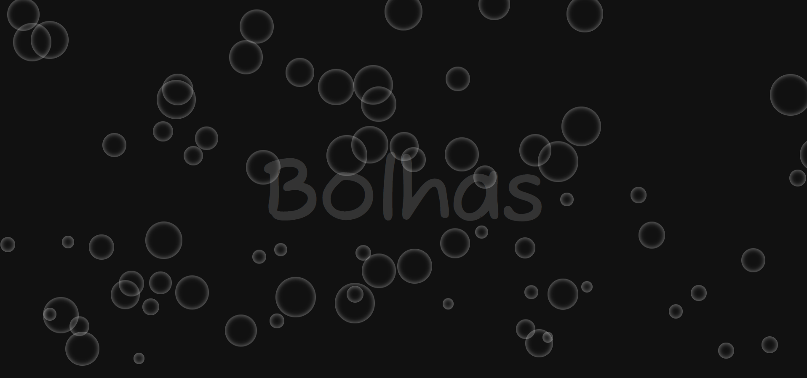

# Efeito Bolhas

Desenvolvido para aprendizado, realizado efeito bolhas. 06/12/2022

[🔗 Clique aqui para acessar] (https://michel-maia.github.io/Efeito-Bolhas/)

## 💻 Tecnologias

- HTML
- CSS
- Javascript 

## Referência

- [youtube] [https://www.youtube.com/@resolvendobug2635]

- [mozilla] [https://developer.mozilla.org/en-US/docs/Web/CSS/pointer-events]

